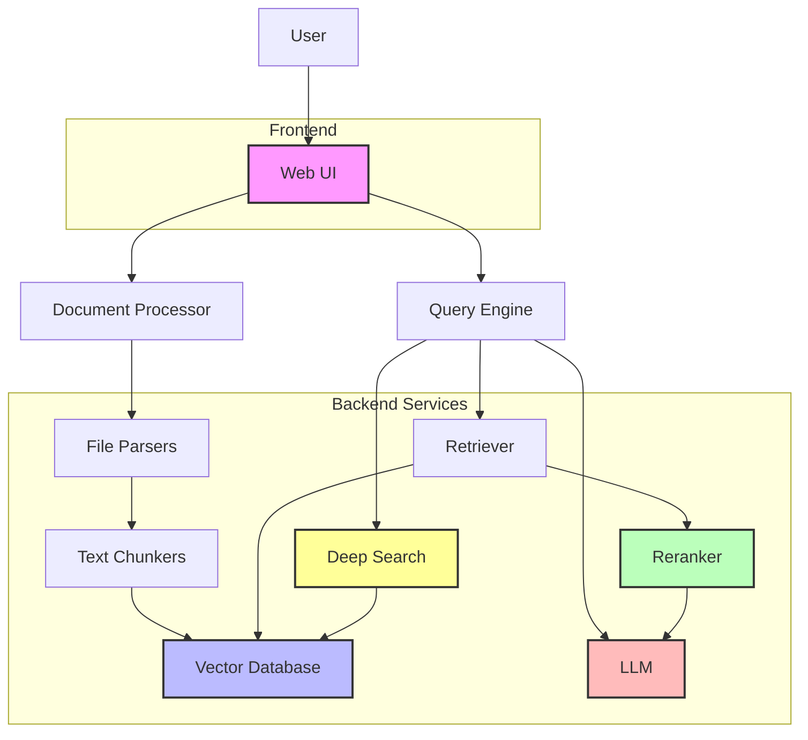
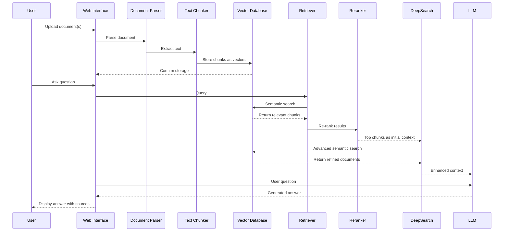

# ✨ manusRAG: Advanced RAG System 🚀

manusRAG is a comprehensive Retrieval-Augmented Generation (RAG) system designed to efficiently process, store, and query various document types. Built on top of the Milvus vector database, it offers a flexible and powerful solution for document analysis and question answering.


## 📋 System Components and Workflow

### 🔄 System Components



### 🔄 Workflow Diagram



## ✨ Features

### 🚀 NEW! - Deep Search Q&A
The system now includes a powerful deep search Q&A feature that performs multi-round, multi-level document retrieval, significantly improving answer accuracy and relevance. This is particularly effective for handling complex knowledge scenarios and domain-specific questions. The WebUI supports visualizing these deep search results, providing transparency into the retrieval process.

### 🆕 NEW! - DOCX File Support
The system now supports Microsoft Word (DOCX) files, making it even easier to process and analyze your Office documents within the RAG pipeline.

### 🔍 NEW! - Folder Monitoring
The system now supports folder monitoring, automatically detecting new or updated files in specified directories and periodically processing them for database insertion, eliminating the need for manual uploads.

| Category | Features | Details |
|----------|----------|---------|
| **📄 Document Processing** | File Format Support | • PDF (via minerU or PyPDF2)<br>• Microsoft Word (DOCX)<br>• Markdown<br>• HTML<br>• Text files |
| **📑 Text Chunking** | Chunking Methods | • Text chunking (textChunker)<br>• Code chunking (codeChunker)<br>• Markdown-aware chunking (markdownChunker)<br>• HTML-aware chunking (htmlChunker) |
| **🗄️ Vector Database** | Milvus Integration | • Efficient semantic search<br>• Collection management<br>• System monitoring<br>• Performance optimization |
| **🔎 Retrieval & Reranking** | Advanced Search | • Configurable retrieval parameters (top_k, etc.)<br>• BGE Reranker v2 m3 for improved relevance<br>• Hybrid retrieval strategies<br>• Deep search with multi-stage retrieval |
| **🖥️ User Interface** | Streamlit Web App | • Single and multiple file upload<br>• Database monitoring and management<br>• Conversation history tracking<br>• Multi-session support<br>• Interactive RAG-powered chat<br>• Real-time deep search visualization<br>• Answer source tracing |
| **⚙️ Automation** | Folder Monitoring | • Automatically monitor specified folders<br>• Detect new and updated files<br>• Periodically process and insert into database<br>• No manual file uploads required |
| **🧠 Deep Q&A** | Enhanced Q&A Capabilities | • Multi-round retrieval enhancement<br>• Complex question processing<br>• Knowledge association capabilities<br>• Precise citation and provenance |

## 🏗️ System Architecture

manusRAG is composed of several integrated services:
1. **📄 Document Processing Pipeline**: Parses and chunks documents
2. **🗄️ Vector Database Service**: Manages embedding storage and retrieval
3. **🔄 Reranking Service**: Improves retrieval quality
4. **💬 Conversation Management**: Handles chat history and context
5. **🖥️ Web Interface**: Provides user-friendly access to all features
6. **🔍 Deep Search Engine**: Enables multi-round, multi-level document retrieval and association

## 🚀 Installation

### Prerequisites
- Python 3.10
- Conda (recommended for environment management)

### Step 1: Setting up the Environment
If you haven't created a virtual environment yet:
```bash
conda create -n manusRAG python=3.10
conda activate manusRAG
```

### Step 2: Installing Dependencies
```bash
pip install -r requirements.txt
```

### Step 3: Setting up minerU (Optional)
minerU provides enhanced PDF parsing capabilities. While not required (PyPDF2 is available as a simpler alternative), it's recommended for better results.

Follow the installation instructions in [minerU README](utils/minerU_app/README.md)

### Step 4: Setting up BGE Reranker
Follow the installation instructions in [BGE Reranker README](utils/bge_reranker_v2_m3/README.md)

### Step 5: Add Openai API Key
Specifiy Your OPENAI_API_KEY in [service config](services/config.py)

## ⚙️ Configuration

manusRAG uses JSON configuration files to customize its behavior. Example configurations are provided in the `examples` directory.

### Data Ingestion Configuration
Customize your data ingestion process by modifying [ingest_data_example_config.json](examples/ingest_data_example_config.json)

### Search Configuration
Customize your search process by modifying [search_example_config.json](examples/search_example_config.json)

### API Parameters Reference

Below are detailed explanations of all parameters used in the configuration files. These parameters correspond to the Request classes in `service.py`. Note that for most users, the default configurations in the `examples` directory should work well without modifications.

#### Document Parsing Parameters

| Parameter | Type | Description | Default |
|-----------|------|-------------|---------|
| `parse_strategy` | string | PDF parsing strategy, either "pypdf2" or "minerU" | "pypdf2" |

#### Text Chunking Parameters

| Parameter | Type | Description | Default |
|-----------|------|-------------|---------|
| `chunk_strategy` | string | Chunking method - "punctuation", "recursive", "python", "html", or "markdown" | N/A (Required) |
| `title` | string | Title for the document being chunked | "" |
| `min_chunk_size` | integer | Minimum size for chunks (PunctuationChunker) | 100 |
| `max_chunk_size` | integer | Maximum size for chunks (PunctuationChunker) | 200 |
| `overlap_chunk_size` | integer | Overlap size between chunks (PunctuationChunker) | 50 |
| `chunk_size` | integer | Target chunk size (RecursiveChunker, PythonChunker) | 200 |
| `separators` | list of strings | Text separators for splitting (RecursiveChunker) | None |
| `keep_separator` | boolean or string | Whether to keep separators - true, false, "start", "end" (RecursiveChunker) | true |
| `is_separator_regex` | boolean | Whether separators are regex patterns (RecursiveChunker) | false |
| `html_headers_to_split_on` | list of tuples | HTML headers to use as splitting points - (tag, name) (HTMLChunker) | [("h1", "Chapter"), ("h2", "Section"), ("h3", "Subsection")] |
| `return_each_element` | boolean | Return each HTML element separately (HTMLChunker) | false |
| `markdown_headers_to_split_on` | list of tuples | Markdown headers to use as splitting points - (header, name) (MarkdownChunker) | [("#", "h1"), ("##", "h2"), ("###", "h3"), ("####", "h4"), ("#####", "h5"), ("######", "h6")] |
| `strip_headers` | boolean | Remove header markers from chunk text (MarkdownChunker) | true |
| `return_each_line` | boolean | Return each markdown line separately (MarkdownChunker) | false |
| `markdown_chunk_limit` | integer | Maximum markdown chunk size (MarkdownChunker) | 200 |
| `format_chunk_flag` | boolean | Whether to format chunks with special formatting | false |

#### Database Ingestion Parameters

| Parameter | Type | Description | Default |
|-----------|------|-------------|---------|
| `batch_size_limit` | integer | Maximum batch size for vectorization and ingestion | 32 |
| `collection_name` | string | Name of the Milvus collection to use | N/A (Required) |
| `database_strategy` | string | Database type - currently only "milvus" is fully supported | "milvus" |
| `embedding_api` | string | Embedding API to use | "openai_embedding_api" |
| `expand_fields` | list of dictionaries | Additional fields to include in vector database | [] |
| `expand_fields_values` | dictionary | Values for the additional fields | {} |

#### Search Parameters

| Parameter | Type | Description | Default |
|-----------|------|-------------|---------|
| `query` | string | Search query text | N/A (Required) |
| `top_k` | integer | Number of results to return | N/A (Required) |
| `collection_name` | string | Name of the collection to search | N/A (Required) |
| `database_strategy` | string | Database type - currently only "milvus" is fully supported | "milvus" |
| `filter` | string | Optional filter expression for search | None |

#### Reranking Parameters

| Parameter | Type | Description | Default |
|-----------|------|-------------|---------|
| `query` | string | Query for reranking | N/A (Required) |
| `top_k` | integer | Number of results after reranking | N/A (Required) |
| `rerank_strategy` | string | Reranking strategy - currently only "bge-reranker-v2-m3" is supported | "bge-reranker-v2-m3" |

> **Note**: While the tables above list all available parameters, **you don't need to specify all of them** in your configuration files. The system provides sensible defaults for most parameters. For beginners, we recommend starting with the example configuration files in the `examples` directory.

## 🚀 Usage

### Starting the System
To start all services (reranker, minerU, RAG backend, and web UI):
```bash
bash run.sh
```

This will:
1. Start the BGE Reranker service
2. Start the minerU service (if installed)
3. Start the RAG backend service
4. Launch the Streamlit web interface

### Stopping the System
To stop all services:
```bash
bash kill.sh
```

### Web Interface
Once started, the system opens a Streamlit-based web interface in your default browser. From there, you can:
- 📄 Upload documents
- 📊 Monitor the database status
- 💬 Create new conversation sessions
- 🔄 Switch between existing sessions
- ❓ Ask questions about your documents
- 🔍 View the retrieved context used for each answer
- 📁 Configure folder monitoring for automatic document ingestion
- 🧠 Use deep search Q&A for complex questions
- 📊 View visualizations of the retrieval process
- 📑 Access detailed sources and citations for answers

### Deep Search Q&A Guide
To use the deep search Q&A feature:
1. Select "Deep Search Mode" in the conversation interface
2. Enter your complex question
3. The system will automatically perform multi-round retrieval, identifying key information points
4. Results will include more accurate answers with detailed source citations
5. The interface visualizes the retrieval process and relationships between information

Deep search is particularly suitable for:
- Complex questions requiring information from multiple documents
- Domain-specific knowledge queries
- Scenarios requiring precise source citations

### Folder Monitoring
To configure folder monitoring:
1. Navigate to the "Folder Monitoring" tab in the web interface
2. Specify the folder path to monitor
3. Set the monitoring interval (how often to check for updates)
4. Choose processing configurations for documents in the folder
5. Start the monitoring service

The system will automatically detect new or updated files in the folder and add them to the vector database after processing.

## 🧩 Advanced Usage

### Custom Pipeline Example
For advanced users, custom pipelines can be created by combining different components. See `examples/pipeline_example.py` for a detailed example.

### Deep Search Configuration
Advanced users can customize deep search behavior by modifying the deep search configuration file:
```bash
examples/deep_search_config.json
```

Key parameters include:
- Search depth levels
- Per-round retrieval count
- Association threshold settings
- Domain-specific knowledge enhancement configurations

### Extending the System
manusRAG is designed to be modular and extensible:
- 🔌 Add new parsers by implementing the `baseParser` interface
- 🧩 Add new chunking strategies by implementing the `baseChunker` interface
- 🔄 Add new reranking methods by extending the reranking service
- 🔍 Customize deep search algorithms by implementing the `deepSearchInterface`