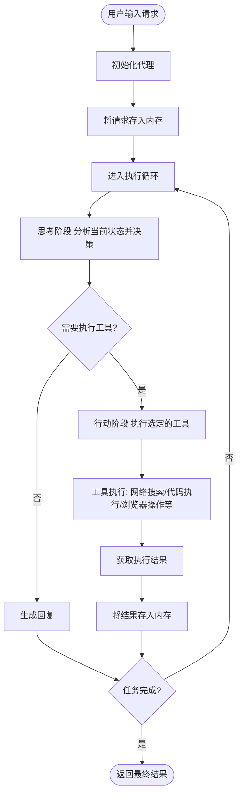

# <center>OpenManus项目调研报告<center/>

## 1. 项目概述

OpenManus是一个强大的智能代理系统，能够执行各种复杂任务，从简单的信息查询到复杂的网页交互和代码执行。该项目基于**ReAct（Reasoning and Acting）模式**，通过大型语言模型（LLM）进行思考和决策，并调用各种工具执行操作。

## 2. agent工作流程

### 2.1 执行流程概述

当用户输入一个prompt后，`agent.run(prompt)`会执行以下步骤：
1. 将用户输入的prompt添加到代理的内存中
2. 进入一个循环，执行多个步骤（最多执行Manus类中定义的`max_steps=20`次）
3. 每个步骤包含"思考"(think)和"行动"(act)两个阶段
4. 直到达到最大步骤数或任务完成（状态变为FINISHED）

### 2.2 详细执行过程

#### 主循环执行
- 进入主循环，执行步骤直到达到最大步骤数或任务完成
- 每个步骤调用`step()`方法，并记录结果
- 检查是否陷入循环（stuck state）

#### 思考阶段(think)
- 向LLM发送当前消息和系统提示
- 获取LLM的响应，包括可能的工具调用
- 记录LLM的思考过程和选择的工具
- 将LLM的响应添加到内存中
- 根据是否有工具调用决定是否需要行动

#### 行动阶段(act)
- 如果没有工具调用，返回最后一条消息内容
- 对每个工具调用，执行相应的工具
- 将工具执行结果添加到内存中
- 检查是否有特殊工具（如Terminate）被调用
- 返回所有工具执行结果的汇总

#### 结束处理
- 如果达到最大步骤数，重置状态并添加相应消息
- 合并所有结果并返回

### 2.3 工作流程图



## 3. Demo

### 3.1 Good Case

**问句**： 帮我收集一下有关AI与爬虫结合的开源项目，收集4个就够了，并写入到当前目录下的

```
INFO     [browser_use] BrowserUse logging setup complete with level info
INFO     [root] Anonymized telemetry enabled. See https://docs.browser-use.com/development/telemetry for more information.
Enter your prompt: 帮我收集一下有关AI与爬虫结合的开源项目，收集4个就够了，并写入到当前目录下的AICrawler.md中
2025-03-14 13:16:27.450 | WARNING  | __main__:main:15 - Processing your request...
2025-03-14 13:16:27.451 | INFO     | app.agent.base:run:137 - Executing step 1/20
2025-03-14 13:16:28.593 | INFO     | app.agent.toolcall:think:55 - ✨ Manus's thoughts: None
2025-03-14 13:16:28.593 | INFO     | app.agent.toolcall:think:56 - 🛠️ Manus selected 1 tools to use
2025-03-14 13:16:28.593 | INFO     | app.agent.toolcall:think:60 - 🧰 Tools being prepared: ['web_search']
2025-03-14 13:16:28.593 | INFO     | app.agent.toolcall:execute_tool:146 - 🔧 Activating tool: 'web_search'...
2025-03-14 13:16:29.274 | INFO     | app.agent.toolcall:act:119 - 🎯 Tool 'web_search' completed its mission! Result: Observed output of cmd `web_search` executed:
['https://www.browse.ai/', 'https://medium.com/@danushidk507/web-scrapping-with-ai-llm-5c0b8f85cbfa', 'https://research.aimultiple.com/ai-web-scraping/', 'https://www.reddit.com/r/Automate/comments/10gc3mi/i_built_an_aipowered_web_scraper_that_can/']
2025-03-14 13:16:29.274 | INFO     | app.agent.base:run:137 - Executing step 2/20
2025-03-14 13:16:34.431 | INFO     | app.agent.toolcall:think:55 - ✨ Manus's thoughts: None
2025-03-14 13:16:34.432 | INFO     | app.agent.toolcall:think:56 - 🛠️ Manus selected 1 tools to use
2025-03-14 13:16:34.432 | INFO     | app.agent.toolcall:think:60 - 🧰 Tools being prepared: ['file_saver']
2025-03-14 13:16:34.433 | INFO     | app.agent.toolcall:execute_tool:146 - 🔧 Activating tool: 'file_saver'...
2025-03-14 13:16:34.435 | INFO     | app.agent.toolcall:act:119 - 🎯 Tool 'file_saver' completed its mission! Result: Observed output of cmd `file_saver` executed:
Content successfully saved to AICrawler.md
2025-03-14 13:16:34.436 | INFO     | app.agent.base:run:137 - Executing step 3/20
2025-03-14 13:16:35.320 | INFO     | app.agent.toolcall:think:55 - ✨ Manus's thoughts: None
2025-03-14 13:16:35.320 | INFO     | app.agent.toolcall:think:56 - 🛠️ Manus selected 1 tools to use
2025-03-14 13:16:35.321 | INFO     | app.agent.toolcall:think:60 - 🧰 Tools being prepared: ['terminate']
2025-03-14 13:16:35.321 | INFO     | app.agent.toolcall:execute_tool:146 - 🔧 Activating tool: 'terminate'...
2025-03-14 13:16:35.321 | INFO     | app.agent.toolcall:_handle_special_tool:178 - 🏁 Special tool 'terminate' has completed the task!
2025-03-14 13:16:35.321 | INFO     | app.agent.toolcall:act:119 - 🎯 Tool 'terminate' completed its mission! Result: Observed output of cmd `terminate` executed:
The interaction has been completed with status: success
2025-03-14 13:16:35.321 | INFO     | __main__:main:17 - Request processing completed.
```

- **执行结果**：

  `./AICrawler.md`:

  1. [Browse.ai](https://www.browse.ai/): A platform that combines AI with web scraping, allowing users to automate data extraction from websites without coding.
  2. [Web Scraping with AI](https://medium.com/@danushidk507/web-scrapping-with-ai-llm-5c0b8f85cbfa): An article discussing how AI can enhance web scraping techniques, including the use of language models.
  3. [AI and Web Scraping](https://research.aimultiple.com/ai-web-scraping/): A research piece that explores the integration of AI in web scraping, focusing on methodologies and applications.
  4. [AI-Powered Web Scraper](https://www.reddit.com/r/Automate/comments/10gc3mi/i_built_an_aipowered_web_scraper_that_can/): A Reddit post where a user shares their experience building an AI-powered web scraper, detailing its capabilities and features.

### 3.2 Bad Case

**问句**： 帮我获取各国2023年GDP，并制成名为countriesGDP.xlsx的Excel表格存在当前目录下

```
INFO     [browser_use] BrowserUse logging setup complete with level info
INFO     [root] Anonymized telemetry enabled. See https://docs.browser-use.com/development/telemetry for more information.
Enter your prompt: 帮我获取各国2023年GDP，并制成名为countriesGDP.xlsx的Excel表格存在当前目录下
2025-03-14 14:07:13.645 | WARNING  | __main__:main:15 - Processing your request...
2025-03-14 14:07:13.646 | INFO     | app.agent.base:run:137 - Executing step 1/20
2025-03-14 14:07:15.206 | INFO     | app.agent.toolcall:think:55 - ✨ Manus's thoughts: None
2025-03-14 14:07:15.206 | INFO     | app.agent.toolcall:think:56 - 🛠️ Manus selected 1 tools to use
2025-03-14 14:07:15.206 | INFO     | app.agent.toolcall:think:60 - 🧰 Tools being prepared: ['web_search']
2025-03-14 14:07:15.207 | INFO     | app.agent.toolcall:execute_tool:146 - 🔧 Activating tool: 'web_search'...
2025-03-14 14:07:16.104 | INFO     | app.agent.toolcall:act:119 - 🎯 Tool 'web_search' completed its mission! Result: Observed output of cmd `web_search` executed:
['https://en.wikipedia.org/wiki/List_of_countries_by_GDP_(nominal)', 'https://www.worldometers.info/gdp/gdp-by-country/', 'https://data.worldbank.org/indicator/NY.GDP.MKTP.CD', 'https://www.360tf.trade/the-top-10-largest-economies-in-the-world-in-2023/', 'https://statisticstimes.com/economy/projected-world-gdp-ranking.php']
2025-03-14 14:07:16.104 | INFO     | app.agent.base:run:137 - Executing step 2/20
2025-03-14 14:07:17.298 | INFO     | app.agent.toolcall:think:55 - ✨ Manus's thoughts: None
2025-03-14 14:07:17.299 | INFO     | app.agent.toolcall:think:56 - 🛠️ Manus selected 1 tools to use
2025-03-14 14:07:17.299 | INFO     | app.agent.toolcall:think:60 - 🧰 Tools being prepared: ['browser_use']
2025-03-14 14:07:17.299 | INFO     | app.agent.toolcall:execute_tool:146 - 🔧 Activating tool: 'browser_use'...
2025-03-14 14:07:21.016 | INFO     | app.agent.toolcall:act:119 - 🎯 Tool 'browser_use' completed its mission! Result: Observed output of cmd `browser_use` executed:
Navigated to https://en.wikipedia.org/wiki/List_of_countries_by_GDP_(nominal)
2025-03-14 14:07:21.017 | INFO     | app.agent.base:run:137 - Executing step 3/20
2025-03-14 14:07:22.062 | INFO     | app.agent.toolcall:think:55 - ✨ Manus's thoughts: None
2025-03-14 14:07:22.062 | INFO     | app.agent.toolcall:think:56 - 🛠️ Manus selected 1 tools to use
2025-03-14 14:07:22.062 | INFO     | app.agent.toolcall:think:60 - 🧰 Tools being prepared: ['browser_use']
2025-03-14 14:07:22.063 | INFO     | app.agent.toolcall:execute_tool:146 - 🔧 Activating tool: 'browser_use'...
2025-03-14 14:07:22.887 | INFO     | app.agent.toolcall:act:119 - 🎯 Tool 'browser_use' completed its mission! Result: Observed output of cmd `browser_use` executed:
<html><head></head><body></body></html>
2025-03-14 14:07:22.887 | INFO     | app.agent.base:run:137 - Executing step 4/20
2025-03-14 14:07:23.871 | INFO     | app.agent.toolcall:think:55 - ✨ Manus's thoughts: None
2025-03-14 14:07:23.871 | INFO     | app.agent.toolcall:think:56 - 🛠️ Manus selected 1 tools to use
2025-03-14 14:07:23.871 | INFO     | app.agent.toolcall:think:60 - 🧰 Tools being prepared: ['browser_use']
2025-03-14 14:07:23.871 | INFO     | app.agent.toolcall:execute_tool:146 - 🔧 Activating tool: 'browser_use'...
2025-03-14 14:07:24.620 | INFO     | app.agent.toolcall:act:119 - 🎯 Tool 'browser_use' completed its mission! Result: Cmd `browser_use` completed with no output
2025-03-14 14:07:24.620 | INFO     | app.agent.base:run:137 - Executing step 5/20
2025-03-14 14:07:25.999 | INFO     | app.agent.toolcall:think:55 - ✨ Manus's thoughts: None
2025-03-14 14:07:25.999 | INFO     | app.agent.toolcall:think:56 - 🛠️ Manus selected 1 tools to use
2025-03-14 14:07:25.999 | INFO     | app.agent.toolcall:think:60 - 🧰 Tools being prepared: ['browser_use']
2025-03-14 14:07:25.999 | INFO     | app.agent.toolcall:execute_tool:146 - 🔧 Activating tool: 'browser_use'...
2025-03-14 14:07:26.811 | INFO     | app.agent.toolcall:act:119 - 🎯 Tool 'browser_use' completed its mission! Result: Observed output of cmd `browser_use` executed:
Scrolled down by 3 pixels
2025-03-14 14:07:26.812 | INFO     | app.agent.base:run:137 - Executing step 6/20
2025-03-14 14:07:27.865 | INFO     | app.agent.toolcall:think:55 - ✨ Manus's thoughts: None
2025-03-14 14:07:27.865 | INFO     | app.agent.toolcall:think:56 - 🛠️ Manus selected 1 tools to use
2025-03-14 14:07:27.865 | INFO     | app.agent.toolcall:think:60 - 🧰 Tools being prepared: ['browser_use']
2025-03-14 14:07:27.865 | INFO     | app.agent.toolcall:execute_tool:146 - 🔧 Activating tool: 'browser_use'...
2025-03-14 14:07:28.603 | INFO     | app.agent.toolcall:act:119 - 🎯 Tool 'browser_use' completed its mission! Result: Observed output of cmd `browser_use` executed:
Scrolled down by 3 pixels
2025-03-14 14:07:28.603 | INFO     | app.agent.base:run:137 - Executing step 7/20
2025-03-14 14:07:29.731 | INFO     | app.agent.toolcall:think:55 - ✨ Manus's thoughts: None
2025-03-14 14:07:29.732 | INFO     | app.agent.toolcall:think:56 - 🛠️ Manus selected 1 tools to use
2025-03-14 14:07:29.732 | INFO     | app.agent.toolcall:think:60 - 🧰 Tools being prepared: ['browser_use']
2025-03-14 14:07:29.732 | INFO     | app.agent.toolcall:execute_tool:146 - 🔧 Activating tool: 'browser_use'...
2025-03-14 14:07:30.488 | INFO     | app.agent.toolcall:act:119 - 🎯 Tool 'browser_use' completed its mission! Result: Observed output of cmd `browser_use` executed:
Scrolled down by 3 pixels
2025-03-14 14:07:30.489 | INFO     | app.agent.base:run:137 - Executing step 8/20
2025-03-14 14:07:31.405 | INFO     | app.agent.toolcall:think:55 - ✨ Manus's thoughts: None
2025-03-14 14:07:31.405 | INFO     | app.agent.toolcall:think:56 - 🛠️ Manus selected 1 tools to use
2025-03-14 14:07:31.405 | INFO     | app.agent.toolcall:think:60 - 🧰 Tools being prepared: ['browser_use']
2025-03-14 14:07:31.406 | INFO     | app.agent.toolcall:execute_tool:146 - 🔧 Activating tool: 'browser_use'...
2025-03-14 14:07:32.179 | INFO     | app.agent.toolcall:act:119 - 🎯 Tool 'browser_use' completed its mission! Result: Observed output of cmd `browser_use` executed:
Scrolled down by 3 pixels
2025-03-14 14:07:32.180 | INFO     | app.agent.base:run:137 - Executing step 9/20
2025-03-14 14:07:33.420 | INFO     | app.agent.toolcall:think:55 - ✨ Manus's thoughts: None
2025-03-14 14:07:33.420 | INFO     | app.agent.toolcall:think:56 - 🛠️ Manus selected 1 tools to use
2025-03-14 14:07:33.420 | INFO     | app.agent.toolcall:think:60 - 🧰 Tools being prepared: ['browser_use']
2025-03-14 14:07:33.421 | INFO     | app.agent.toolcall:execute_tool:146 - 🔧 Activating tool: 'browser_use'...
2025-03-14 14:07:34.178 | INFO     | app.agent.toolcall:act:119 - 🎯 Tool 'browser_use' completed its mission! Result: Observed output of cmd `browser_use` executed:
Scrolled down by 3 pixels
2025-03-14 14:07:34.178 | INFO     | app.agent.base:run:137 - Executing step 10/20
2025-03-14 14:07:35.193 | INFO     | app.agent.toolcall:think:55 - ✨ Manus's thoughts: None
2025-03-14 14:07:35.194 | INFO     | app.agent.toolcall:think:56 - 🛠️ Manus selected 1 tools to use
2025-03-14 14:07:35.194 | INFO     | app.agent.toolcall:think:60 - 🧰 Tools being prepared: ['browser_use']
2025-03-14 14:07:35.194 | INFO     | app.agent.toolcall:execute_tool:146 - 🔧 Activating tool: 'browser_use'...
2025-03-14 14:07:35.950 | INFO     | app.agent.toolcall:act:119 - 🎯 Tool 'browser_use' completed its mission! Result: Observed output of cmd `browser_use` executed:
Scrolled down by 3 pixels
2025-03-14 14:07:35.950 | INFO     | app.agent.base:run:137 - Executing step 11/20
2025-03-14 14:07:37.411 | INFO     | app.agent.toolcall:think:55 - ✨ Manus's thoughts: None
2025-03-14 14:07:37.411 | INFO     | app.agent.toolcall:think:56 - 🛠️ Manus selected 1 tools to use
2025-03-14 14:07:37.411 | INFO     | app.agent.toolcall:think:60 - 🧰 Tools being prepared: ['browser_use']
2025-03-14 14:07:37.411 | INFO     | app.agent.toolcall:execute_tool:146 - 🔧 Activating tool: 'browser_use'...
2025-03-14 14:07:38.162 | INFO     | app.agent.toolcall:act:119 - 🎯 Tool 'browser_use' completed its mission! Result: Observed output of cmd `browser_use` executed:
Scrolled down by 3 pixels
2025-03-14 14:07:38.163 | INFO     | app.agent.base:run:137 - Executing step 12/20
2025-03-14 14:07:39.503 | INFO     | app.agent.toolcall:think:55 - ✨ Manus's thoughts: None
2025-03-14 14:07:39.503 | INFO     | app.agent.toolcall:think:56 - 🛠️ Manus selected 1 tools to use
2025-03-14 14:07:39.503 | INFO     | app.agent.toolcall:think:60 - 🧰 Tools being prepared: ['browser_use']
2025-03-14 14:07:39.503 | INFO     | app.agent.toolcall:execute_tool:146 - 🔧 Activating tool: 'browser_use'...
2025-03-14 14:07:40.400 | INFO     | app.agent.toolcall:act:119 - 🎯 Tool 'browser_use' completed its mission! Result: Observed output of cmd `browser_use` executed:
Scrolled down by 3 pixels
2025-03-14 14:07:40.400 | INFO     | app.agent.base:run:137 - Executing step 13/20
2025-03-14 14:07:41.464 | INFO     | app.agent.toolcall:think:55 - ✨ Manus's thoughts: None
2025-03-14 14:07:41.465 | INFO     | app.agent.toolcall:think:56 - 🛠️ Manus selected 1 tools to use
2025-03-14 14:07:41.465 | INFO     | app.agent.toolcall:think:60 - 🧰 Tools being prepared: ['browser_use']
2025-03-14 14:07:41.465 | INFO     | app.agent.toolcall:execute_tool:146 - 🔧 Activating tool: 'browser_use'...
2025-03-14 14:07:42.422 | INFO     | app.agent.toolcall:act:119 - 🎯 Tool 'browser_use' completed its mission! Result: Observed output of cmd `browser_use` executed:
Scrolled down by 3 pixels
2025-03-14 14:07:42.422 | INFO     | app.agent.base:run:137 - Executing step 14/20
2025-03-14 14:07:43.438 | INFO     | app.agent.toolcall:think:55 - ✨ Manus's thoughts: None
2025-03-14 14:07:43.438 | INFO     | app.agent.toolcall:think:56 - 🛠️ Manus selected 1 tools to use
2025-03-14 14:07:43.438 | INFO     | app.agent.toolcall:think:60 - 🧰 Tools being prepared: ['browser_use']
2025-03-14 14:07:43.439 | INFO     | app.agent.toolcall:execute_tool:146 - 🔧 Activating tool: 'browser_use'...
2025-03-14 14:07:44.339 | INFO     | app.agent.toolcall:act:119 - 🎯 Tool 'browser_use' completed its mission! Result: Observed output of cmd `browser_use` executed:
Scrolled down by 3 pixels
2025-03-14 14:07:44.339 | INFO     | app.agent.base:run:137 - Executing step 15/20
2025-03-14 14:07:45.483 | INFO     | app.agent.toolcall:think:55 - ✨ Manus's thoughts: None
2025-03-14 14:07:45.483 | INFO     | app.agent.toolcall:think:56 - 🛠️ Manus selected 1 tools to use
2025-03-14 14:07:45.483 | INFO     | app.agent.toolcall:think:60 - 🧰 Tools being prepared: ['browser_use']
2025-03-14 14:07:45.484 | INFO     | app.agent.toolcall:execute_tool:146 - 🔧 Activating tool: 'browser_use'...
2025-03-14 14:07:46.382 | INFO     | app.agent.toolcall:act:119 - 🎯 Tool 'browser_use' completed its mission! Result: Observed output of cmd `browser_use` executed:
Scrolled down by 3 pixels
2025-03-14 14:07:46.382 | INFO     | app.agent.base:run:137 - Executing step 16/20
2025-03-14 14:07:47.779 | INFO     | app.agent.toolcall:think:55 - ✨ Manus's thoughts: None
2025-03-14 14:07:47.780 | INFO     | app.agent.toolcall:think:56 - 🛠️ Manus selected 1 tools to use
2025-03-14 14:07:47.780 | INFO     | app.agent.toolcall:think:60 - 🧰 Tools being prepared: ['browser_use']
2025-03-14 14:07:47.780 | INFO     | app.agent.toolcall:execute_tool:146 - 🔧 Activating tool: 'browser_use'...
2025-03-14 14:07:48.566 | INFO     | app.agent.toolcall:act:119 - 🎯 Tool 'browser_use' completed its mission! Result: Observed output of cmd `browser_use` executed:
Scrolled down by 3 pixels
2025-03-14 14:07:48.566 | INFO     | app.agent.base:run:137 - Executing step 17/20
2025-03-14 14:07:49.641 | INFO     | app.agent.toolcall:think:55 - ✨ Manus's thoughts: None
2025-03-14 14:07:49.642 | INFO     | app.agent.toolcall:think:56 - 🛠️ Manus selected 1 tools to use
2025-03-14 14:07:49.642 | INFO     | app.agent.toolcall:think:60 - 🧰 Tools being prepared: ['browser_use']
2025-03-14 14:07:49.642 | INFO     | app.agent.toolcall:execute_tool:146 - 🔧 Activating tool: 'browser_use'...
2025-03-14 14:07:50.553 | INFO     | app.agent.toolcall:act:119 - 🎯 Tool 'browser_use' completed its mission! Result: Observed output of cmd `browser_use` executed:
Scrolled down by 3 pixels
2025-03-14 14:07:50.554 | INFO     | app.agent.base:run:137 - Executing step 18/20
2025-03-14 14:07:51.616 | INFO     | app.agent.toolcall:think:55 - ✨ Manus's thoughts: None
2025-03-14 14:07:51.617 | INFO     | app.agent.toolcall:think:56 - 🛠️ Manus selected 1 tools to use
2025-03-14 14:07:51.617 | INFO     | app.agent.toolcall:think:60 - 🧰 Tools being prepared: ['browser_use']
2025-03-14 14:07:51.617 | INFO     | app.agent.toolcall:execute_tool:146 - 🔧 Activating tool: 'browser_use'...
2025-03-14 14:07:52.516 | INFO     | app.agent.toolcall:act:119 - 🎯 Tool 'browser_use' completed its mission! Result: Observed output of cmd `browser_use` executed:
Scrolled down by 3 pixels
2025-03-14 14:07:52.516 | INFO     | app.agent.base:run:137 - Executing step 19/20
2025-03-14 14:07:53.719 | INFO     | app.agent.toolcall:think:55 - ✨ Manus's thoughts: None
2025-03-14 14:07:53.719 | INFO     | app.agent.toolcall:think:56 - 🛠️ Manus selected 1 tools to use
2025-03-14 14:07:53.719 | INFO     | app.agent.toolcall:think:60 - 🧰 Tools being prepared: ['browser_use']
2025-03-14 14:07:53.720 | INFO     | app.agent.toolcall:execute_tool:146 - 🔧 Activating tool: 'browser_use'...
2025-03-14 14:07:54.475 | INFO     | app.agent.toolcall:act:119 - 🎯 Tool 'browser_use' completed its mission! Result: Observed output of cmd `browser_use` executed:
Scrolled down by 3 pixels
2025-03-14 14:07:54.475 | INFO     | app.agent.base:run:137 - Executing step 20/20
2025-03-14 14:07:55.867 | INFO     | app.agent.toolcall:think:55 - ✨ Manus's thoughts: None
2025-03-14 14:07:55.868 | INFO     | app.agent.toolcall:think:56 - 🛠️ Manus selected 1 tools to use
2025-03-14 14:07:55.868 | INFO     | app.agent.toolcall:think:60 - 🧰 Tools being prepared: ['browser_use']
2025-03-14 14:07:55.868 | INFO     | app.agent.toolcall:execute_tool:146 - 🔧 Activating tool: 'browser_use'...
2025-03-14 14:07:56.759 | INFO     | app.agent.toolcall:act:119 - 🎯 Tool 'browser_use' completed its mission! Result: Observed output of cmd `browser_use` executed:
Scrolled down by 3 pixels
2025-03-14 14:07:56.760 | INFO     | __main__:main:17 - Request processing completed.
```

- **执行结果**：网页交互执行全失败，导致20轮ReAct流程达到上限自动退出

## 4. 工具执行详情

### 4.1 PythonExecute工具
- 执行Python代码字符串
- 有超时和安全限制
- 捕获打印输出而非返回值
- 适用于数据处理、计算和简单脚本执行

### 4.2 WebSearch工具
- 执行网络搜索（支持Google、Baidu、DuckDuckGo）
- 返回相关链接列表
- 可配置返回结果数量
- 适用于获取最新信息和研究特定主题

### 4.3 BrowserUseTool工具
- 控制浏览器进行网页交互
- 支持多种操作：导航、点击、输入文本、截图、获取HTML/文本、执行JavaScript等
- 管理浏览器标签页
- 适用于复杂的网页交互和数据抓取

### 4.4 FileSaver工具
- 将内容保存到本地文件
- 支持写入和追加模式
- 自动创建必要的目录
- 适用于保存生成的内容、代码或数据

### 4.5 Terminate工具
- 用于终止代理执行
- 将代理状态设置为FINISHED
- 适用于任务完成或需要提前结束执行

## 5. 应用场景

OpenManus可以应用于多种场景：
- 自动化信息收集和研究
- 网页数据抓取和分析
- 代码生成和执行
- 文档生成和保存
- 复杂任务的自动化执行

## 6. 总结

OpenManus是一个功能强大、架构清晰的智能代理系统。通过结合LLM的思考能力和多种工具的执行能力，它能够处理各种复杂任务。其核心执行流程`agent.run`实现了一个完整的思考-行动循环，使代理能够根据用户输入自主决策和执行操作。

这种设计使得OpenManus成为一个通用的自动化助手，能够适应各种应用场景，为用户提供强大的自动化能力。随着更多工具的添加和LLM能力的提升，OpenManus的功能将进一步扩展，为用户提供更加智能和高效的服务。 